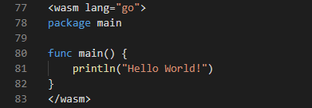
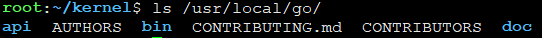

# vue-go-wasm-loader

Easy way to write golang in vue.

Just write golang in vue compoment with wasm tag.



# Install

First, we should install [golang](https://golang.org/dl/) in our system. Please download and untar it into `/usr/local/` directory.



You can also install in windows WSL([Windows Subsystem for Linux](https://en.wikipedia.org/wiki/Windows_Subsystem_for_Linux))


Second, link go program into system bin path or set `/usr/local/go/bin` into PATH envirement variable.

```
# link go program into system bin path
ln -sf /usr/local/go/ /usr/bin/go

# set `/usr/local/go/bin` into PATH envirement variable
export PATH=$PATH:/usr/local/go/bin
```

You can also fellow this [guide](https://golang.org/doc/install).

Third, install vue-go-wasm-loader

```
npm install vue-go-wasm-loader
```

# Settings

Add this loader into vue's sub loader.


**webpack.base.conf.js:**

```json
    {
        test: /\.vue$/,
        loader: 'vue-loader',
        options: {
            wasm: 'vue-go-wasm-loader'
        }
    },
```

If your project is create from vue-cli, please edit `vue-loader.conf.js`.

**vue-loader.conf.js:**
```json
  loaders: { ... utils.cssLoaders({
        sourceMap: sourceMapEnabled,
        extract: isProduction
    }) ,
    wasm: 'vue-go-wasm-loader'
  },
```

# Start


## Simple example
This is an minilize vue wasm example

```go
<template>
  <div></div>
</template>

<script>
export default {
  name: 'WASM'
}
</script>

<wasm lang="go">
package main

func main() {
    println("Hello World!")
}
</wasm>
```

## A more complex example

This example show how to bind a golang func into a vue compoment, and make sure display the button after the wasm is loaded.

```go
<template>
  <div v-if="WASMReady">
    <input type="button" v-on:click="CustomFunc()" value="Press"/>
  </div>
</template>

<script>
export default {
  name: 'WASM',
  mounted () {
    this.$options.wasm.then(e => {
      /* global ExportFunction */
      ExportFunction.apply(this)
      this.WASMReady = true
    })
  },
  data () {
    return {
      WASMReady: false
    }
  }
}
</script>

<wasm lang="go">
package main

import "syscall/js"

func ExportFunction(this js.Value, args []js.Value) interface{} {
    cb:=js.FuncOf(CustomFunc) // Your go func here
    this.Set("CustomFunc",cb) // Your js compoments function name here
    return nil
}

func CustomFunc(this js.Value, args []js.Value) interface{} {
    println("CustomFunc called")
    return nil
}

func main() {
    c := make(chan struct{}, 0)
    cb := js.FuncOf(ExportFunction)
    js.Global().Set("ExportFunction", cb)
    println("Web Assembly loadded!")
    <-c
    cb.Release()
}
</wasm>

```

# License

MIT